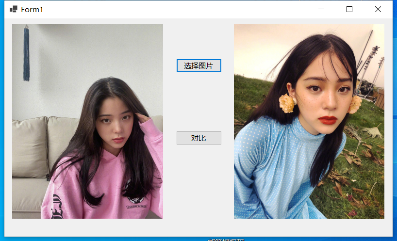
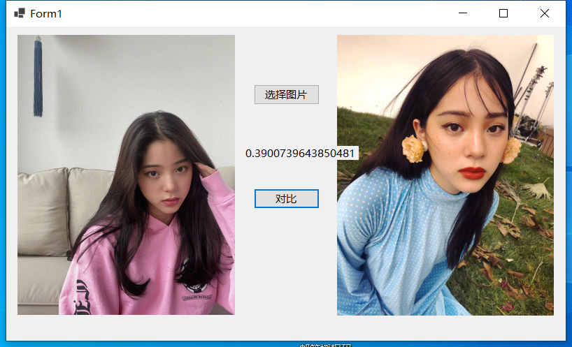

# ComparisonOfFacialSimilarityDemo
人脸相似度对比简单demo，两张不同的人像进行相似度对比
使用 https://github.com/takuya-takeuchi/FaceRecognitionDotNet 这个进行编写的winfrom小程序
模型来源于 https://github.com/ageitgey/face_recognition_models  These models were created by Davis King and are licensed in the public domain or under CC0 1.0 Universal. See LICENSE.

# 演示截图

# 注意事项
代码下载下来，还缺少 .dat 模型文件，一个4个
FaceRecognition.Create("C:\\Users\\admin\\Desktop\\XXXXX\\dat");
这里路径，关于其他api，请参考上面的git仓库地址
